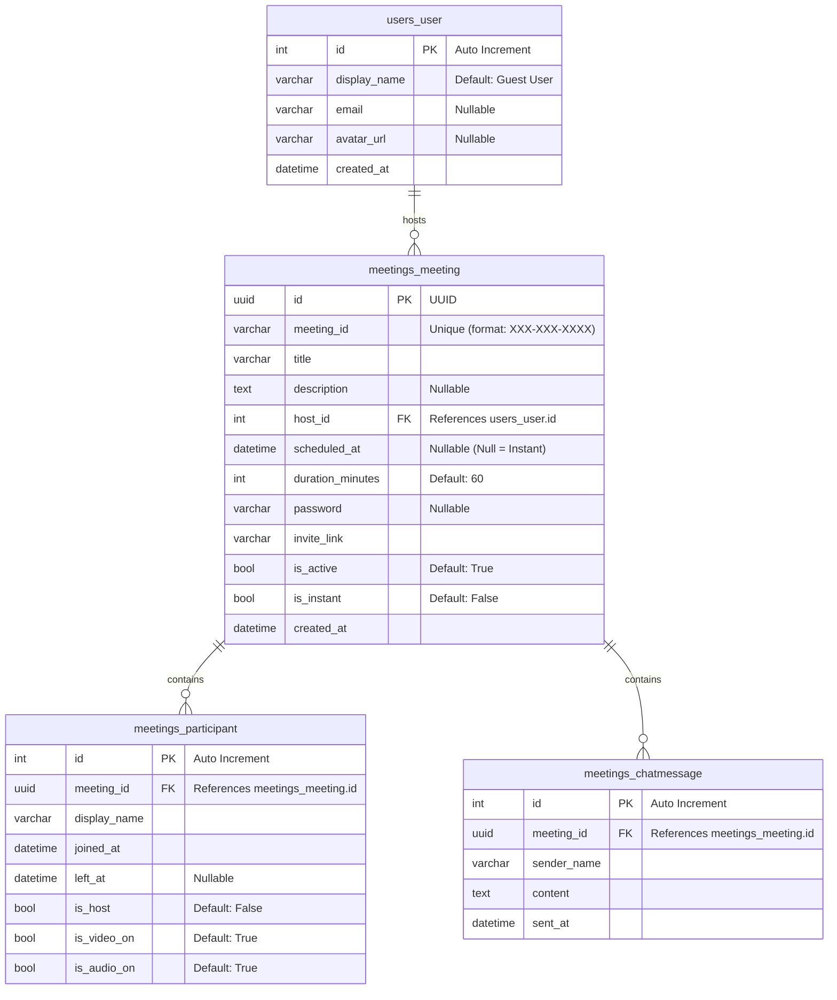

# Zoom Web Clone — Fullstack SDE Assignment

A fully functional web-based Zoom clone built for an SDE evaluation assignment. Designed with a Django/DRF REST API backend, SQLite relational database, and a Next.js 14 App Router frontend.

---

## 🚀 Setup & Execution Instructions

### Prerequisites
- **Python 3.10+**
- **Node.js 18+ & npm**

---

### 1. Backend Setup (Django + DRF)

1. Navigate to the `backend/` directory:
   ```bash
   cd backend
   ```
2. Install required packages:
   ```bash
   pip install django django-cors-headers djangorestframework
   ```
3. Generate and apply database migrations:
   ```bash
   python manage.py makemigrations meetings
   python manage.py migrate
   ```
4. Seed the database with sample data (creates 1 default user, 3 upcoming meetings, and 2 recent meetings):
   ```bash
   python manage.py seed
   ```
5. Start the backend server on port 8000:
   ```bash
   python manage.py runserver --noreload
   ```

The REST API will now be listening on `http://127.0.0.1:8000/api/`.

---

### 2. Frontend Setup (Next.js 14 App Router)

1. Open a new terminal and navigate to the `frontend/` directory:
   ```bash
   cd frontend
   ```
2. Install dependencies (installs React, Next.js, Tailwind, Axios, and Lucide React):
   ```bash
   npm install
   ```
3. Start the Next.js development server:
   ```bash
   npm run dev
   ```

The application will compile and be accessible at `http://localhost:3000/`.

---

## 🛠 Tech Stack Selection & Interview Justifications

During your SDE evaluation interview, you can use these talking points to defend your technology selections:

### 1. Backend: Django (with DRF) vs. FastAPI
* **Why Choose Django?**: Django is a mature, batteries-included framework. It offers an out-of-the-box **Object-Relational Mapper (ORM)**, a built-in **migration management engine**, and a structured MVC layout. 
* **The FastAPI Contrast**: While FastAPI is high-performance, it requires you to manually configure and glue third-party packages together (SQLAlchemy/Alembic/Pydantic). For a fullstack CRUD-centric application with a tight deadline, Django REST Framework viewsets and serializers minimize boilerplate code, allowing a fully working core flow in hours rather than days.

### 2. Database: SQLite (Relational SQL) vs. MongoDB (NoSQL)
* **SQLite Advantage**: SQLite is a serverless, single-file relational database. It requires zero configuration, is embedded directly within the project folder, and is highly performant for low-to-medium throughput, making it perfect for rapid local development and assignment submissions.
* **SQL vs. NoSQL (Mongoose mapping)**: 
  * In MongoDB (NoSQL), data is stored as hierarchical JSON documents, and relationships are often embedded as subdocuments.
  * In SQLite (SQL), data is highly structured, normalized into tables, and references other tables via **Foreign Key constraints**. This guarantees **ACID compliance** (data consistency, e.g. a participant cannot join a meeting that doesn't exist).

---

## 📊 Database Schema & Design Rationale

Here is a breakdown of the database tables and how their structures map to Mongoose models.



### Table 1: `users_user`
- **Purpose**: Stores account details. Since authentication is disabled, we seed and default to ID `1` (`display_name = "Guest User"`).
- **Mongoose Mapping**: Equivalent to a `User` collection.
- **Rationale**: Keeps users separated from meetings, allowing profile changes to reflect globally instead of manually updating embedded copies in documents.

### Table 2: `meetings_meeting`
- **Purpose**: Tracks meetings (both instant and scheduled).
- **Mongoose Mapping**: Equivalent to a `Meeting` collection where the host is referenced by ObjectId (`type: mongoose.Schema.Types.ObjectId, ref: 'User'`).
- **Rationale**:
  - **UUID Primary Key**: The unique `id` is a UUID (Universally Unique Identifier). This hides sequence order. If we used simple auto-incrementing integers (e.g. `/meeting/1`, `/meeting/2`), malicious users could predict meeting URLs and jump in.
  - **Visual `meeting_id`**: A separate 10-digit random ID formatted as `XXX-XXX-XXXX` is generated for the human-friendly join input, matching actual Zoom behavior.

### Table 3: `meetings_participant`
- **Purpose**: Audit log of who entered which meeting, when they left, and their microphone/camera states.
- **Mongoose Mapping**: In Mongoose, you might store participants as an array of embedded subdocuments inside the meeting object.
- **Rationale**: Relational databases normalization. Embedding a dynamic array inside a single row is highly discouraged in SQL. A separate join table allows querying participants efficiently, tracking history (left/joined timestamps), and scales without document size limitations (e.g. MongoDB's 16MB document cap).

### Table 4: `meetings_chatmessage`
- **Purpose**: Stores chat history.
- **Mongoose Mapping**: Equivalent to a `ChatMessage` collection pointing to a meeting reference.

---

## 💻 Frontend Page Architecture (Next.js 14 App Router)

Next.js 14 App Router splits components into **Server Components** and **Client Components** to optimize page loads.

### 1. Dashboard (`app/page.js` - Server Component)
* **How it works**: Fetches the upcoming and recent meetings directly from the Django API on the server using `fetch('url', { cache: 'no-store' })` during request time.
* **Why?**: Bypasses browser loading states. The page loads with HTML pre-populated, which is great for SEO and performance. It passes the raw data to `DashboardClient` to handle state.

### 2. Interactive Dashboard (`app/DashboardClient.jsx` - Client Component)
* **How it works**: Uses React hooks (`useState`, `useRouter`) to handle modals, forms, and triggers.
* **Join Meeting Flow**: Validates the user's meeting ID input. Tries to match a full invite link first and strips out the Meeting ID query, then requests validation from Django (`GET /api/meetings/validate/<mid>`). If it does not exist, it displays an inline alert immediately instead of navigating.
* **Schedule Meeting Flow**: Submits scheduled times and durations, then triggers a page refresh (`router.refresh()`) which makes Next.js re-fetch server-side properties in `page.js` to update the lists in real-time.

### 3. Pre-Join Screen (`app/join/page.js` - Client Component)
* **How it works**: Leverages `navigator.mediaDevices.getUserMedia` to render a live mirror video grid, letting users toggle hardware and set their display name before pushing to the meeting URL.

### 4. Meeting Room (`app/meeting/[id]/page.js` - Client Component)
* **How it works**: Hosts a full dark-theme Zoom grid. Toggles microphone and camera tracks, polls `/api/chat/` every 3 seconds to synchronize real-time messages, displays participants joining from other tabs, and simulates recording, emoji reactions, and screen sharing.

---

## 💡 Assumptions Made
1. **Single User Mode**: Authentication is omitted per requirements. Guest User (ID `1`) acts as the active session.
2. **WebRTC Integration**: Actual peer-to-peer WebRTC video streaming is simulated. The grid renders your live camera and displays visual animated placeholders for other participants fetched from the database (opening additional tabs/windows in the same meeting will dynamically join them and render their camera states).
# zoom-clone

